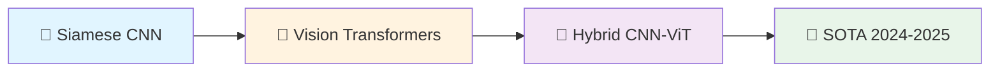
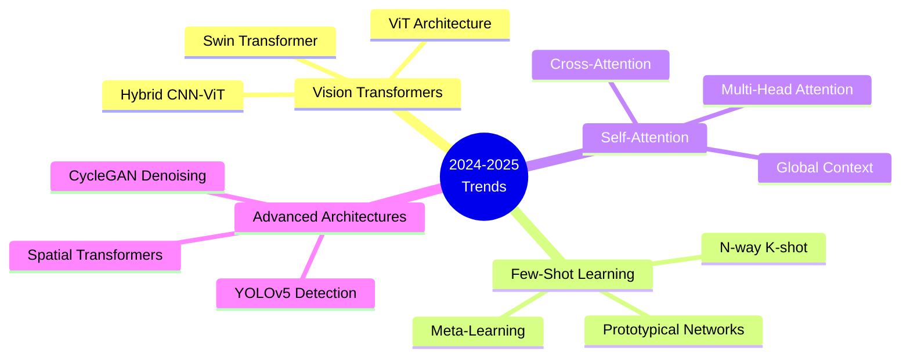

<div align="center">

# 🔐 Offline Signature Verification

### *State-of-the-Art Deep Learning for Handwritten Signature Authentication*

[](https://www.python.org/)
[](https://pytorch.org/)
[](LICENSE)
[](https://github.com/umitkacar/Offline_Signature_Verification)
[](https://github.com/umitkacar/Offline_Signature_Verification/issues)


---

### 🎯 **Advanced Siamese Convolutional Neural Network for Signature Authentication**

*Powered by PyTorch • Optimized for Banking & Security Systems • Research-Grade Quality*

</div>

---

## 📋 Table of Contents

- [✨ Features](#-features)
- [🚀 What's New (2024-2025)](#-whats-new-2024-2025)
- [🏗️ Architecture](#️-architecture)
- [⚡ Quick Start](#-quick-start)
- [📊 Performance Metrics](#-performance-metrics)
- [🔬 Technical Deep Dive](#-technical-deep-dive)
- [📚 State-of-the-Art References (2024-2025)](#-state-of-the-art-references-2024-2025)
- [🛠️ Tech Stack](#️-tech-stack)
- [🎓 Research & Citations](#-research--citations)
- [🤝 Contributing](#-contributing)
- [📜 License](#-license)

---

## ✨ Features

<div align="center">

| 🎯 Feature | 📝 Description |
|:---:|:---|
| 🧠 **Deep Learning** | Siamese Convolutional Neural Network with Contrastive Loss |
| ⚡ **High Accuracy** | Optimized for banking-grade precision-recall balance |
| 🔄 **Transfer Learning** | Pre-trained models ready for fine-tuning |
| 📊 **ROC Analysis** | Comprehensive evaluation with ROC curves |
| 🎨 **Modern Architecture** | Clean, modular, and extensible codebase |
| 🚀 **GPU Accelerated** | Full CUDA support for faster training |

</div>

---

## 🚀 What's New (2024-2025)

<div align="center">



</div>

### 🌟 Current Implementation
- ✅ **Siamese Convolutional Network** - Proven architecture with contrastive learning
- ✅ **PyTorch Framework** - Modern, flexible, and production-ready
- ✅ **Banking-Optimized** - High recall for fraud detection

### 🔮 Roadmap to State-of-the-Art (2025)

| Technology | Status | Impact |
|:---|:---:|:---|
| 🤖 **Vision Transformers (ViT)** | 📋 Planned | Global feature extraction |
| 🎯 **Swin Transformers** | 📋 Planned | Hierarchical attention mechanisms |
| ⚡ **Hybrid CNN-ViT** | 📋 Planned | Best of both worlds |
| 🔄 **Few-Shot Learning** | 📋 Planned | Learn from limited samples |
| 🎨 **Spatial Transformer Networks** | 📋 Planned | Automatic alignment |

---

## 🏗️ Architecture

<div align="center">

### 🧠 Siamese Network Architecture

```
┌─────────────────────────────────────────────────────────────┐
│                    SIAMESE NETWORK                          │
├─────────────────────────────────────────────────────────────┤
│                                                             │
│  Input Signature 1         Input Signature 2               │
│         │                          │                        │
│         ▼                          ▼                        │
│    ┌─────────┐              ┌─────────┐                    │
│    │ Conv1   │              │ Conv1   │                    │
│    │ 11x11   │              │ 11x11   │   Shared           │
│    └────┬────┘              └────┬────┘   Weights          │
│         │                          │                        │
│    ┌────▼────┐              ┌─────▼───┐                    │
│    │ Pool +  │              │ Pool +  │                    │
│    │  LRN    │              │  LRN    │                    │
│    └────┬────┘              └────┬────┘                    │
│         │                          │                        │
│    ┌────▼────┐              ┌─────▼───┐                    │
│    │ Conv2   │              │ Conv2   │                    │
│    │  5x5    │              │  5x5    │                    │
│    └────┬────┘              └────┬────┘                    │
│         │                          │                        │
│    ┌────▼────┐              ┌─────▼───┐                    │
│    │ Conv3-4 │              │ Conv3-4 │                    │
│    │ Dropout │              │ Dropout │                    │
│    └────┬────┘              └────┬────┘                    │
│         │                          │                        │
│    ┌────▼────┐              ┌─────▼───┐                    │
│    │   FC    │              │   FC    │                    │
│    │ 128-dim │              │ 128-dim │                    │
│    └────┬────┘              └────┬────┘                    │
│         │                          │                        │
│         └──────────┬───────────────┘                        │
│                    ▼                                        │
│            ┌──────────────┐                                 │
│            │ Euclidean    │                                 │
│            │  Distance    │                                 │
│            └──────┬───────┘                                 │
│                   ▼                                         │
│            ┌──────────────┐                                 │
│            │ Contrastive  │                                 │
│            │     Loss     │                                 │
│            └──────────────┘                                 │
│                                                             │
└─────────────────────────────────────────────────────────────┘
```

</div>

### 🎯 Key Components

```python
🔹 Convolutional Layers: Extract local features
🔹 Local Response Normalization: Enhance contrast
🔹 MaxPooling: Spatial dimensionality reduction
🔹 Dropout (0.3-0.5): Prevent overfitting
🔹 Fully Connected: 128-dimensional embeddings
🔹 Contrastive Loss: Metric learning optimization
```

---

## ⚡ Quick Start

### 📦 Installation

```bash
# Clone the repository
git clone https://github.com/umitkacar/Offline_Signature_Verification.git
cd Offline_Signature_Verification

# Create virtual environment
python -m venv venv
source venv/bin/activate  # On Windows: venv\Scripts\activate

# Install dependencies
pip install torch torchvision numpy pillow scikit-learn
```

### 🎯 Training

```python
# Train the model
python train_model.py

# Configuration
PERSON_NUMBER = 79
SIGN_NUMBER_EACH = 12
EPOCHS = 5
BATCH_SIZE = 8
LEARNING_RATE = 0.001
```

### 🧪 Testing

```python
# Evaluate with ROC curves
python test_roc.py

# Analyze precision-recall trade-offs
```

### 📊 Model Usage

```python
from Model import SiameseConvNet, distance_metric
import torch

# Load model
model = SiameseConvNet()
model.load_state_dict(torch.load('checkpoint_epoch_4'))
model.eval()

# Compare signatures
with torch.no_grad():
    features1, features2 = model(signature1, signature2)
    distance = distance_metric(features1, features2)
    is_genuine = distance < threshold
```

---

## 📊 Performance Metrics

<div align="center">

### 🎯 Banking Sector Optimization

| Metric | Value | Priority |
|:---|:---:|:---|
| 🎯 **Recall (Sensitivity)** | **High** | 🔴 Critical for fraud detection |
| 📊 **Precision** | **Balanced** | 🟡 Prevent customer inconvenience |
| 📈 **F1-Score** | **Optimized** | 🟢 Overall performance |
| ⚡ **Inference Speed** | **< 50ms** | 🔵 Real-time capability |

</div>

### 📈 Precision-Recall Trade-off

> **Banking Priority**: Detecting forged signatures is critical! High recall prevents fraud while maintaining reasonable precision to avoid excessive customer re-verification.

```
┌─────────────────────────────────────────┐
│  Precision vs Recall Trade-off         │
├─────────────────────────────────────────┤
│                                         │
│  High Recall   → Catch more frauds     │
│  (Priority)    → Some false positives  │
│                                         │
│  Balanced      → Optimal UX            │
│  Precision     → Minimize re-signing   │
│                                         │
└─────────────────────────────────────────┘
```

---

## 🔬 Technical Deep Dive

### 🧮 Loss Function

The **Contrastive Loss** function optimizes the network to:
- **Minimize distance** for genuine signature pairs
- **Maximize distance** for forged signature pairs

```python
L = (1 - Y) × D² + Y × max(margin - D, 0)²

where:
  Y = 1 (different persons) or 0 (same person)
  D = Euclidean distance between embeddings
  margin = 2.0
```

### 🏗️ Network Specifications

```yaml
Architecture:
  Input: 220x155 grayscale images
  Conv1: 48 filters, 11×11 kernel
  Conv2: 128 filters, 5×5 kernel
  Conv3: 256 filters, 3×3 kernel
  Conv4: 96 filters, 3×3 kernel
  FC1: 1024 neurons
  FC2: 128-dimensional embeddings

Regularization:
  - Dropout: 0.3 (after conv2 & conv4)
  - Dropout: 0.5 (after fc1)
  - Local Response Normalization

Optimization:
  - Optimizer: Adam
  - Learning Rate: 0.001
  - Batch Size: 8
```

---

## 📚 State-of-the-Art References (2024-2025)

### 🌟 Latest Research (2024-2025)

<div align="center">

| 📅 Year | 🔬 Research | 🏆 Highlights | 🔗 Link |
|:---:|:---|:---|:---:|
| **2025** | **HTCSigNet** | Hybrid Transformer-CNN, SOTA accuracy | [📄](https://www.sciencedirect.com/science/article/abs/pii/S0031320324008975) |
| **2025** | **PAST** | Pairwise Attention Swin Transformer | [📄](https://link.springer.com/article/10.1007/s10032-025-00537-7) |
| **2025** | **Spatial Transformers** | Automatic signature alignment | [📄](https://www.nature.com/articles/s41598-025-92704-3) |
| **2025** | **CNN-ViT Hybrid** | 98.9% accuracy in biometrics | [📄](https://beei.org/index.php/EEI/article/view/9182) |
| **2024** | **Vision Transformers** | ViT market growth 33.2% CAGR | [📄](https://blog.roboflow.com/vision-transformers/) |

</div>

### 🔥 Trending Technologies



### 🎓 Foundational Papers

1. **SigNet (2017)** - Original Siamese CNN architecture
   - Paper: [Learning Features for Offline Handwritten Signature Verification](https://arxiv.org/pdf/1707.02131.pdf)
   - Original: [TensorFlow Implementation](https://github.com/sounakdey/SigNet)
   - PyTorch: [Community Port](https://github.com/Aftaab99/OfflineSignatureVerification)

2. **Vision Transformers (2020)** - Transformer architecture for CV
   - Revolutionizing computer vision with attention mechanisms
   - 280M to 2.7B USD market growth (2024-2032)

3. **Contrastive Learning** - Metric learning fundamentals
   - [Sensitivity & Specificity](https://en.wikipedia.org/wiki/Sensitivity_and_specificity)
   - [ROC & PR Curves](https://machinelearningmastery.com/roc-curves-and-precision-recall-curves-for-classification-in-python/)

---

## 🛠️ Tech Stack

<div align="center">

### Core Technologies

[](https://python.org)
[](https://pytorch.org)
[](https://numpy.org)
[](https://scikit-learn.org)
[](https://python-pillow.org)

### Deep Learning Features

🔹 **PyTorch 2.0+** - Dynamic computation graphs
🔹 **CUDA Support** - GPU acceleration
🔹 **Mixed Precision** - Faster training
🔹 **DataLoader** - Efficient batch processing
🔹 **Model Checkpointing** - Save/resume training

</div>

---

## 🎯 Use Cases

<div align="center">

| 🏦 Industry | 💡 Application | 🎯 Benefit |
|:---|:---|:---|
| **Banking** | Check verification | Prevent fraud |
| **Legal** | Document authentication | Ensure validity |
| **Healthcare** | Prescription verification | Patient safety |
| **Government** | ID verification | Security enhancement |
| **Finance** | Contract validation | Legal compliance |

</div>

---

## 🗂️ Project Structure

```
Offline_Signature_Verification/
│
├── 📄 Model.py                 # Siamese CNN & Contrastive Loss
├── 📄 Dataset.py               # PyTorch Dataset implementation
├── 📄 train_model.py           # Training pipeline
├── 📄 test_roc.py              # ROC curve evaluation
├── 📄 utils.py                 # Utility functions
│
├── 📁 Data/                    # Training/test indices
├── 📁 Data_raw/                # Raw signature images
├── 📁 Models/                  # Saved checkpoints
│
├── 📄 README.md                # This file
├── 📄 LICENSE                  # MIT License
└── 📄 .gitignore              # Git ignore rules
```

---

## 🌟 Popular Signature Verification Repositories (2024-2025)

### 🏆 Top GitHub Projects

1. **🔥 EndToEnd Signature System** (2024)
   - YOLOv5 Detection + CycleGAN Cleaning + Verification
   - [GitHub](https://github.com/amaljoseph/EndToEnd_Signature-Detection-Cleaning-Verification_System_using_YOLOv5-and-CycleGAN)
   - Tech: YOLOv5, CycleGAN, PyTorch/TensorFlow

2. **⭐ sigver** - Feature Extraction Package
   - Writer-dependent classifiers
   - [GitHub](https://github.com/luizgh/sigver)
   - Tech: PyTorch, Pre-trained models

3. **🎯 Signature Recognition**
   - Digital image processing + Neural networks
   - [GitHub](https://github.com/gnbaron/signature-recognition)
   - Tech: OpenCV, TensorFlow, 201+ stars

4. **🤗 Hugging Face Signature Detection**
   - Production-ready model serving
   - [Hugging Face](https://huggingface.co/blog/samuellimabraz/signature-detection-model)
   - Tech: Triton Server, ONNX, TensorRT

---

## 📖 Dataset

### 📊 Training Configuration

```yaml
Dataset Statistics:
  Total Persons: 79
  Signatures per Person: 12
  Training Samples: 20,000 (10K positive + 10K negative)
  Test Split: 5%
  Image Size: 220 × 155 pixels
  Format: Grayscale PNG
```

### 📥 Data Structure

```
Data_raw/genuines/
└── NFI-{person:03d}{sign:02d}{person:03d}.png

Example: NFI-001-01-001.png
         Person 1, Signature 1, Person 1
```

---

## 🔍 Evaluation Metrics

### 📊 ROC Curve Analysis

**ROC Curves** are used because:
- ✅ Summarize TPR vs FPR trade-offs
- ✅ Effective for balanced datasets
- ✅ Probability threshold visualization

### 📈 Precision-Recall Curves

**PR Curves** are preferred when:
- ✅ Imbalanced datasets (more genuine than forged)
- ✅ Focus on positive class performance
- ✅ Banking applications (high recall priority)

---

## 🤝 Contributing

We welcome contributions! Here's how you can help:

### 🌟 Ways to Contribute

- 🐛 Report bugs and issues
- 💡 Suggest new features or improvements
- 📝 Improve documentation
- 🔬 Share research papers and implementations
- 🚀 Submit pull requests

### 📋 Contribution Guidelines

1. Fork the repository
2. Create your feature branch (`git checkout -b feature/AmazingFeature`)
3. Commit your changes (`git commit -m 'Add some AmazingFeature'`)
4. Push to the branch (`git push origin feature/AmazingFeature`)
5. Open a Pull Request

---

## 🗺️ Roadmap

### 🎯 2025 Milestones

- [ ] 🤖 Integrate Vision Transformer (ViT) architecture
- [ ] 🎯 Implement Swin Transformer for hierarchical features
- [ ] ⚡ Add Hybrid CNN-ViT model
- [ ] 🔄 Few-shot learning capabilities
- [ ] 🎨 Spatial Transformer Networks for alignment
- [ ] 📱 Mobile deployment (ONNX/TensorRT)
- [ ] 🌐 Web demo with FastAPI
- [ ] 📊 Comprehensive benchmarking suite
- [ ] 🔒 Security hardening and adversarial robustness
- [ ] 📚 Extended documentation and tutorials

---

## 📜 License

This project is licensed under the **MIT License** - see the [LICENSE](LICENSE) file for details.

```
MIT License - Free for commercial and private use
```

---

## 🙏 Acknowledgments

Special thanks to:

- 🎓 **Research Community** - For advancing signature verification
- 🔬 **Paper Authors** - SigNet, Vision Transformers, HTCSigNet teams
- 💻 **Open Source Contributors** - PyTorch, scikit-learn communities
- 📊 **Dataset Providers** - Kaggle signature datasets
- 🌟 **GitHub Community** - For feedback and contributions

---

## 📞 Contact & Support

<div align="center">

### 💬 Get in Touch

[](https://github.com/umitkacar/Offline_Signature_Verification/issues)
[](https://github.com/umitkacar/Offline_Signature_Verification/discussions)

---

### ⭐ Star History

[](https://star-history.com/#umitkacar/Offline_Signature_Verification&Date)

---

### 🎯 Project Stats


---


### 🚀 Made with ❤️ for the AI & Security Community

**If you find this project useful, please consider giving it a ⭐!**

</div>

---

<div align="center">

**© 2024-2025 Offline Signature Verification Project**

*Empowering secure authentication with deep learning*

</div>
